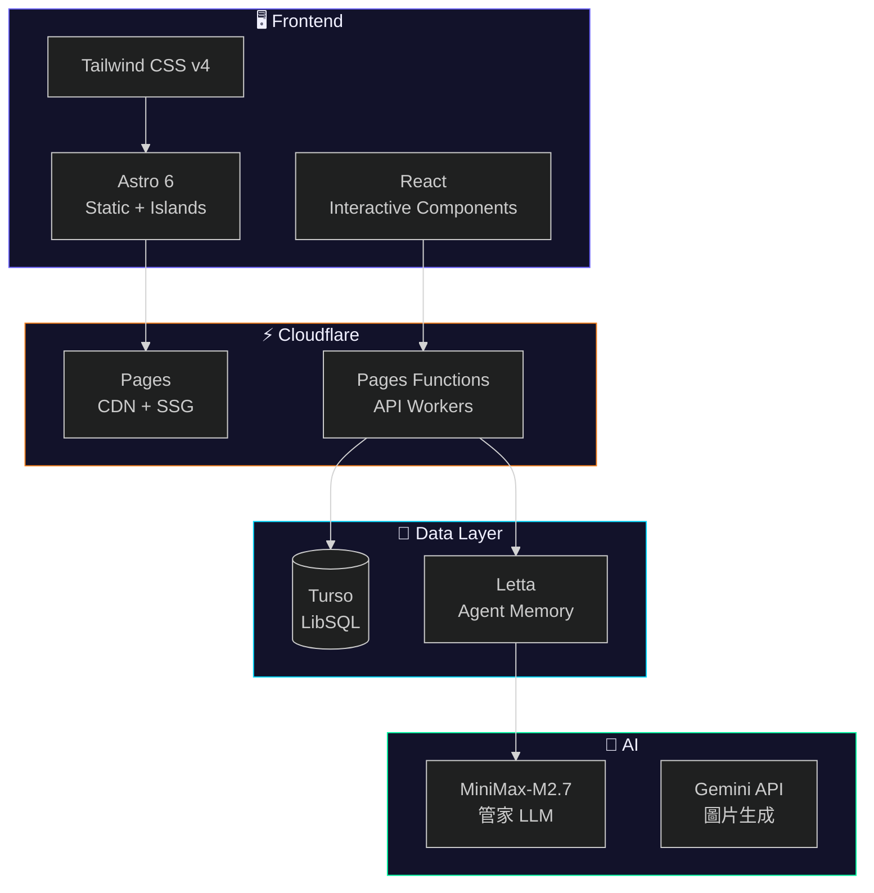
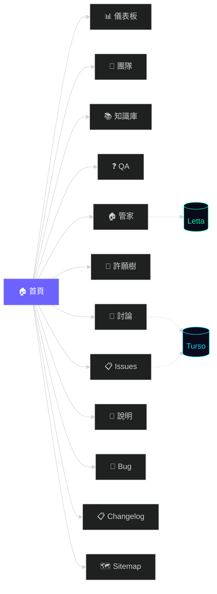
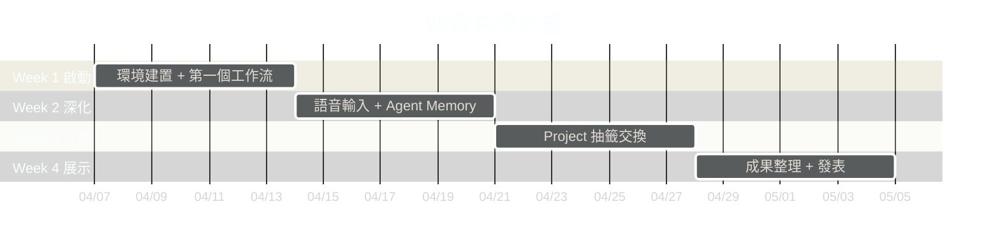
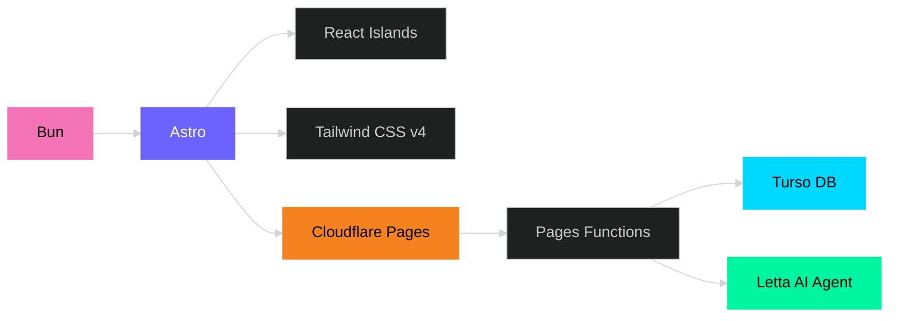

# 🌀 Cyclone-26 — AI 工作流共學團

> **26'Q2 四週共學計畫** — Cyclone 隊長 × 生活黑客共學團
>
> 🔗 **https://cyclone.tw**

讓每位成員在四週內打造屬於自己的 AI 工作流，透過共學網站記錄進度、分享成果。

---

## 📸 概覽

| 功能 | 說明 |
|------|------|
| 🏠 **Cyclone 管家** | Letta 長期記憶 AI 管家，記住你的每次對話 |
| 🔒 **QA 知識集** | AES-GCM 加密的密碼保護問答 |
| 📋 **Issues** | GitHub-style 問題追蹤，對應 Changelog 版本 |
| 💬 **討論區** | 公開留言板，支援分類篩選 |
| 🌳 **許願樹** | 互助機制 + 積分系統 |
| 📊 **儀表板** | 個人進度追蹤 |

---

## 🏗️ 技術架構



---

## 🗺️ 網站結構



---

## 🚀 快速開始

### 環境需求

- [Bun](https://bun.sh/) >= 1.3
- [Wrangler](https://developers.cloudflare.com/workers/wrangler/) >= 4.0

### 安裝

```bash
# Clone
git clone git@github.com:cyclone-tw/cyclone-workflow.git
cd cyclone-workflow

# 安裝依賴
bun install

# 設定環境變數
cp .env.example .env
# 編輯 .env 填入你的 API keys
```

### 環境變數

建立 `.env`，填入以下變數：

```env
# Letta Agent
LETTA_API_KEY=your-letta-api-key

# Turso Database
TURSO_DATABASE_URL=libsql://your-db.turso.io
TURSO_AUTH_TOKEN=your-turso-token

# Gemini (圖片生成，選填)
GEMINI_API_KEY=your-gemini-key
```

### 開發

```bash
# 啟動開發伺服器
bun run dev

# 建置
bun run build

# 部署到 Cloudflare Pages
bun run deploy
```

### 初始化資料庫

```bash
# 部署後，初始化 Turso DB schema + seed 成員資料
curl -X POST https://cyclone.tw/api/db/init
```

---

## 📁 專案結構

```
cyclone-workflow/
├── src/
│   ├── pages/           # Astro 頁面 (13 頁)
│   │   ├── index.astro        # 首頁
│   │   ├── dashboard/         # 儀表板
│   │   ├── team/              # 團隊
│   │   ├── knowledge/         # 知識庫
│   │   ├── qa/                # QA 知識集
│   │   ├── agent/             # Cyclone 管家
│   │   ├── wishlist/          # 許願樹
│   │   ├── discuss/           # 討論區
│   │   ├── issue/             # Issues
│   │   ├── readme/            # 使用說明
│   │   ├── bug/               # Bug 回報
│   │   ├── changelog/         # Changelog
│   │   └── sitemap/           # Sitemap
│   ├── components/      # React Islands
│   │   ├── agent/             # ChatBox (對話 + 歷史)
│   │   ├── qa/                # QAList (AES-GCM 解密)
│   │   ├── discuss/           # MessageBoard
│   │   ├── issues/            # IssueBoard
│   │   └── bug/               # BugForm
│   ├── layouts/         # Layout.astro (GTM + GA4)
│   ├── lib/             # 共用模組
│   │   ├── constants.ts       # 成員、導航、週次
│   │   ├── version.ts         # 版本號 + Changelog 資料
│   │   ├── crypto.ts          # AES-GCM 加解密
│   │   ├── db.ts              # Turso client
│   │   ├── letta.ts           # Letta client
│   │   └── qa-data.ts         # 加密 QA 資料
│   └── styles/
│       └── global.css         # Tailwind v4 + 主題變數
├── functions/           # Cloudflare Pages Functions
│   └── api/
│       ├── agent/chat.ts      # 管家對話 API
│       ├── agent/history.ts   # 對話歷史 API
│       ├── db/init.ts         # DB 初始化
│       ├── messages/          # 討論區 API
│       └── issues/            # Issues API
├── public/
│   ├── images/          # Gemini AI 生成圖片
│   └── favicon.svg
├── scripts/
│   ├── encrypt-qa.ts    # QA 加密腳本
│   └── generate-images.ts  # 圖片生成腳本
├── astro.config.mjs
├── wrangler.toml
├── WORKLOG.md
└── plan0.md             # 原始規劃文件
```

---

## 📋 API Endpoints

| Method | Endpoint | 說明 |
|--------|----------|------|
| `POST` | `/api/agent/chat` | 管家對話（Letta + 存 DB） |
| `GET` | `/api/agent/history` | 對話歷史（分頁 + 搜尋） |
| `POST` | `/api/db/init` | 初始化 DB schema |
| `GET` | `/api/messages` | 讀取討論留言 |
| `POST` | `/api/messages` | 發表留言 |
| `GET` | `/api/issues` | Issue 列表 |
| `POST` | `/api/issues` | 建立 Issue |
| `GET` | `/api/issues/:id` | Issue 詳情 + 留言 |
| `PATCH` | `/api/issues/:id` | 更新 Issue 狀態 |
| `POST` | `/api/issues/:id` | 新增 Issue 留言 |

---

## 👥 共學團成員

| 暱稱 | Tag | 角色 |
|------|-----|------|
| 🌀 Cyclone | #2707 | 隊長 / 原PO |
| 🧪 βenben | #0010 | Z.ai |
| ⚡ Dar | #3808 | 技術開發 |
| 🎯 Benson | #2808 | 企劃設計 |
| 🦋 Tiffanyhou | #2623 | 成員 |
| ☀️ 早安 | #1329 | 成員 |

---

## 📅 四週計畫



---

## 🛡️ 安全

- 所有 API keys 存放在 `.env`（gitignored）和 Cloudflare Pages Secrets
- QA 知識集使用 AES-GCM 客戶端加密（PBKDF2 + 100K iterations）
- Git history 已清洗，確保無 token/key 洩漏
- 管家對話歷史存於 Turso DB，不經第三方

---

## 📄 License

本專案為 Cyclone 隊長 × 生活黑客共學團內部使用。

---

<details>
<summary><h2>🌐 English Version</h2></summary>

# 🌀 Cyclone-26 — AI Workflow Co-Learning Group

> **26'Q2 Four-Week Program** — Cyclone × Life Hacker Community
>
> 🔗 **https://cyclone.tw**

A collaborative learning platform where each member builds their own AI workflow in four weeks.

## Tech Stack



## Pages (13 total)

| Page | Path | Description |
|------|------|-------------|
| Home | `/` | Landing with hero, features, timeline |
| Dashboard | `/dashboard` | Personal progress tracking |
| Team | `/team` | 6 members, project exchange |
| Knowledge | `/knowledge` | Workflow templates, best practices |
| QA | `/qa` | AES-GCM encrypted Q&A |
| Agent | `/agent` | AI butler chat with long-term memory |
| Wishlist | `/wishlist` | Mutual help + point system |
| Discuss | `/discuss` | Public message board |
| Issues | `/issue` | GitHub-style issue tracker |
| Readme | `/readme` | Usage guide + learning resources |
| Bug Report | `/bug` | Bug report form (clipboard copy) |
| Changelog | `/changelog` | Version history |
| Sitemap | `/sitemap` | Site architecture (Mermaid) |

## Quick Start

```bash
git clone git@github.com:cyclone-tw/cyclone-workflow.git
cd cyclone-workflow
bun install
cp .env.example .env  # Fill in your API keys
bun run dev
```

## Environment Variables

```env
LETTA_API_KEY=your-letta-api-key
TURSO_DATABASE_URL=libsql://your-db.turso.io
TURSO_AUTH_TOKEN=your-turso-token
GEMINI_API_KEY=your-gemini-key  # Optional, for image generation
```

## Deploy

```bash
bun run build
wrangler pages deploy dist --project-name=cyclone-26
```

## Security

- All secrets in `.env` (gitignored) + Cloudflare Pages Secrets
- QA uses AES-GCM client-side encryption (PBKDF2, 100K iterations)
- Git history scrubbed clean — no tokens/keys in any commit
- Chat history stored in Turso DB, no third-party exposure

</details>

---

*Built by dar #3808 — v20260407.10*
