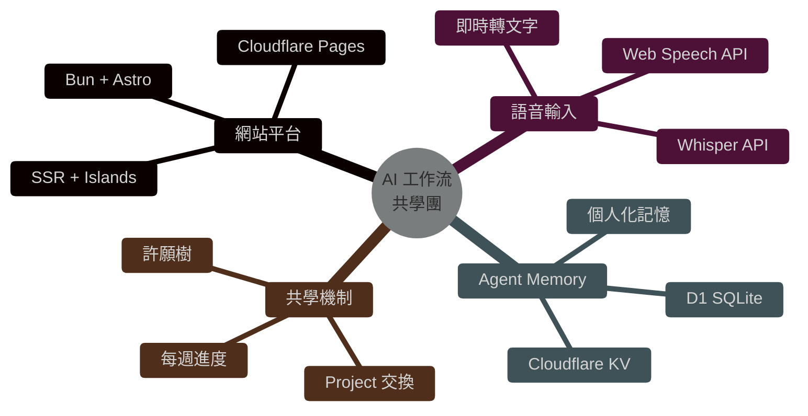
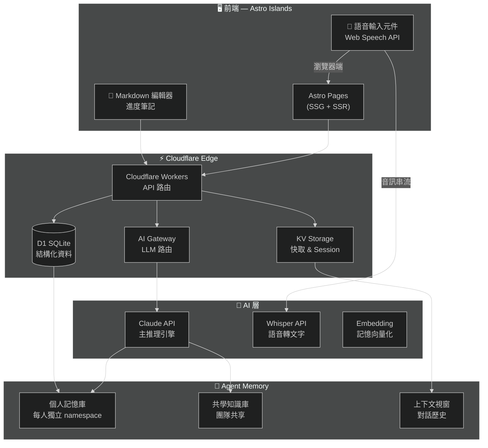
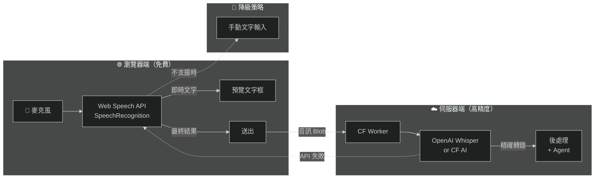
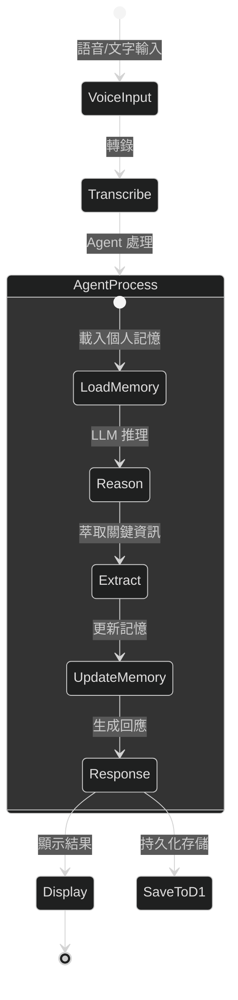
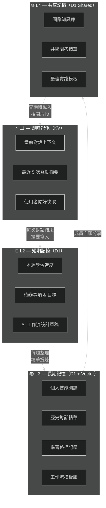
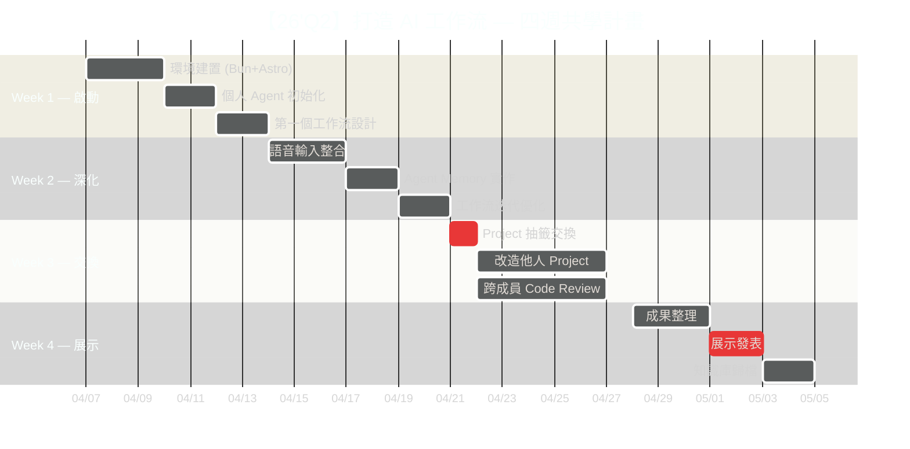
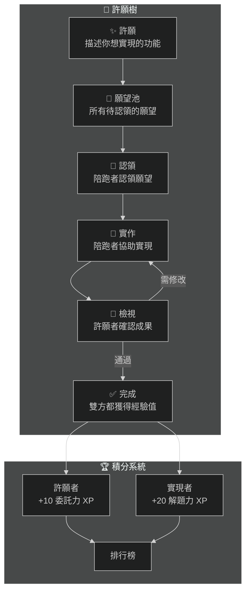
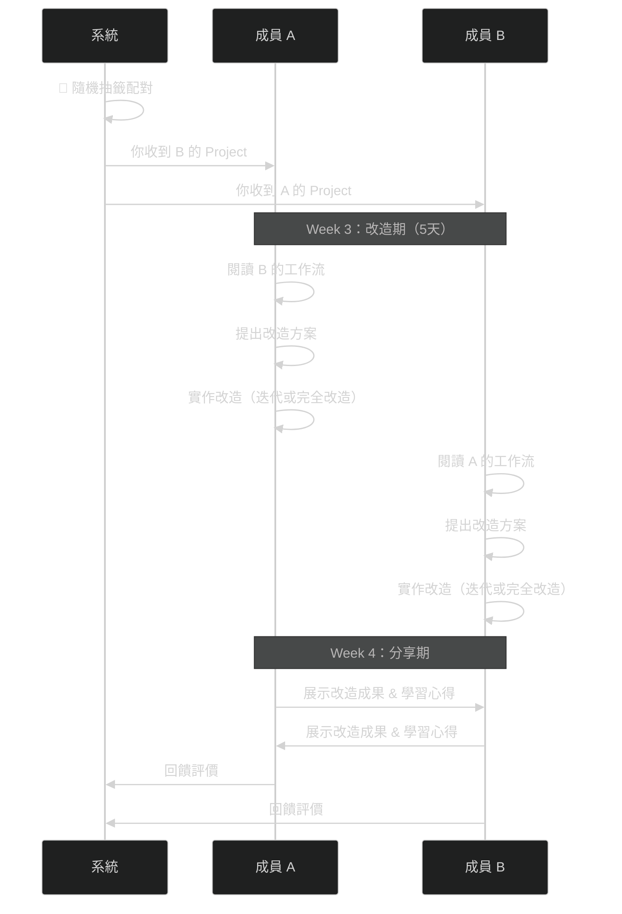

> 📅 2026.04.07｜Cyclone 隊長 × 生活黑客共學團
> 

> 🏷️ Tags: #AI工作流 #共學團 #BunAstro #CloudflarePages #語音輸入 #AgentMemory
> 

---

## 🧭 專案總覽

本頁是【26'Q2】打造 AI 工作流共學團的**網站規劃文件**，包含技術架構、提示詞設計、語音輸入方案、個人 Agent Memory 系統，以及參考資料彙整。

**共學團目標**：讓每位成員在 4 週內打造屬於自己的 AI 工作流，並透過共學網站記錄進度、分享成果。

**核心成員**：Cyclone（隊長/原PO）、βenben（[Z.ai](http://Z.ai)）、Dar（#3808）、Benson（#2808）、Tiffanyhou（#2623）、早安（#1329）



---

## 🏗️ 技術架構設計

### 整體架構圖



### 技術選型理由

| 技術 | 選擇 | 理由 |
| --- | --- | --- |
| Runtime | Bun | 建構速度比 pnpm 快 2x+，原生 TS 支援 |
| Framework | Astro | Islands 架構、零 JS 預設、SSG+SSR 混合 |
| Hosting | Cloudflare Pages | 全球 CDN、免費額度大、Workers 整合 |
| Database | D1 (SQLite) | Edge 原生、零冷啟動、SQL 熟悉度高 |
| Cache | KV | 超低延遲、適合 Session 與快取 |
| AI Gateway | CF AI Gateway | 統一 LLM 路由、成本監控、速率限制 |
| 語音 | Web Speech API + Whisper | 瀏覽器端免費 + 伺服器端高精度備援 |

---

## 🎤 語音輸入系統設計

### 雙軌語音架構



### 語音輸入元件規格

每個頁面區塊都嵌入語音輸入按鈕，支援：

- **即時預覽**：邊說邊顯示文字（Web Speech API `interim` results）
- **語言切換**：繁體中文 `zh-TW` / 英文 `en-US` 自動偵測
- **靜音偵測**：3 秒無聲自動結束錄音
- **編輯確認**：轉錄完成後可手動修改再送出
- **Agent 觸發**：送出後自動觸發個人 Agent 處理

---

## 🧠 個人 Agent Memory 系統

### 記憶架構



### 記憶層次設計



### D1 資料表設計

```sql
-- 使用者表
CREATE TABLE users (
  id TEXT PRIMARY KEY,
  name TEXT NOT NULL,
  discord_id TEXT,
  preferences JSON DEFAULT '{}',
  created_at DATETIME DEFAULT CURRENT_TIMESTAMP
);

-- 記憶表
CREATE TABLE memories (
  id TEXT PRIMARY KEY,
  user_id TEXT NOT NULL,
  type TEXT CHECK(type IN ('fact','preference','goal','skill','interaction')),
  content TEXT NOT NULL,
  importance REAL DEFAULT 0.5,
  access_count INTEGER DEFAULT 0,
  last_accessed DATETIME,
  created_at DATETIME DEFAULT CURRENT_TIMESTAMP,
  FOREIGN KEY (user_id) REFERENCES users(id)
);

-- 對話歷史表
CREATE TABLE conversations (
  id TEXT PRIMARY KEY,
  user_id TEXT NOT NULL,
  input_type TEXT CHECK(input_type IN ('voice','text')),
  input_text TEXT,
  agent_response TEXT,
  memories_used JSON DEFAULT '[]',
  created_at DATETIME DEFAULT CURRENT_TIMESTAMP,
  FOREIGN KEY (user_id) REFERENCES users(id)
);

-- 週進度表
CREATE TABLE weekly_progress (
  id TEXT PRIMARY KEY,
  user_id TEXT NOT NULL,
  week_number INTEGER,
  goals JSON DEFAULT '[]',
  achievements JSON DEFAULT '[]',
  reflections TEXT,
  workflow_snapshot JSON,
  created_at DATETIME DEFAULT CURRENT_TIMESTAMP,
  FOREIGN KEY (user_id) REFERENCES users(id)
);

-- 共享知識庫
CREATE TABLE shared_knowledge (
  id TEXT PRIMARY KEY,
  contributor_id TEXT NOT NULL,
  title TEXT NOT NULL,
  content TEXT NOT NULL,
  category TEXT,
  upvotes INTEGER DEFAULT 0,
  created_at DATETIME DEFAULT CURRENT_TIMESTAMP,
  FOREIGN KEY (contributor_id) REFERENCES users(id)
);
```

---

## 📄 網站提示詞設計（System Prompts）

### 全域 System Prompt

```
你是「AI 工作流共學團」的專屬 AI 助手。你服務的是雷蒙三十生活黑客社群的共學團成員。

## 你的角色
- 你是每位成員的個人 AI 教練，幫助他們設計和優化自己的 AI 工作流
- 你記得每位成員的背景、目標、進度和偏好
- 你用繁體中文溝通，語氣親切但專業，像社群裡的學長姐

## 記憶系統
- 你有該成員的個人記憶（技能、目標、過往對話精華）
- 你有團隊共享知識庫（最佳實踐、工作流模板）
- 每次對話結束，你會自動萃取關鍵資訊更新記憶

## 核心能力
1. **工作流設計**：幫助成員從日常重複任務中識別自動化機會
2. **工具推薦**：根據成員技能等級推薦 n8n / OpenClaw / Claude Code 等工具
3. **進度追蹤**：記錄每週目標與達成情況，給予建設性回饋
4. **知識連結**：將成員的問題連結到團隊知識庫中的相關資源
5. **語音互動**：支援語音輸入，將口語化表達整理成結構化筆記

## 互動原則
- 先確認理解，再給建議
- 使用 Mermaid 圖表視覺化工作流設計
- 引用團隊知識庫時標明出處
- 鼓勵成員分享成果到共享知識庫
- 每次回應結尾提供 1-2 個可執行的下一步行動
```

### 語音輸入專用 Prompt

```
## 語音輸入處理指令

你收到的是語音轉文字的結果，可能包含：
- 口語化表達（「嗯」「那個」「就是」）
- 斷句不清晰
- 同音字錯誤（繁體中文常見）

請你：
1. 先理解使用者的意圖，忽略語氣詞
2. 將口語整理成結構化的筆記格式
3. 確認你的理解是否正確
4. 如果涉及工作流設計，自動生成 Mermaid 流程圖
5. 萃取關鍵資訊（工具名稱、目標、問題）存入記憶
```

### 週進度回顧 Prompt

```
## 週進度回顧模式

現在是第 {week_number} 週的回顧時間。

根據該成員的記憶，請：
1. 摘要本週的學習活動和成果
2. 對照上週設定的目標，標記完成/未完成
3. 識別遇到的障礙和瓶頸
4. 建議下週的 2-3 個具體目標
5. 如果有值得分享的成果，建議投稿到共享知識庫

格式要求：
- 使用 emoji 標記狀態（✅ 完成 / 🔄 進行中 / ❌ 未開始）
- 附上學習路徑的 Mermaid 圖
- 語氣鼓勵但誠實
```

---

## 🗂️ 網站頁面結構

```mermaid
%%{init: {'theme': 'dark'}}%%
flowchart TD
    Home["🏠 首頁\n共學團介紹"] --> Dashboard["📊 個人儀表板"]
    Home --> Team["👥 團隊頁面"]
    Home --> Knowledge["📚 知識庫"]
    Home --> Wishlist["🌳 許願樹"]
    
    Dashboard --> MyWorkflow["我的工作流"]
    Dashboard --> WeeklyLog["每週進度"]
    Dashboard --> MyAgent["我的 Agent"]
    Dashboard --> VoiceNote["語音筆記"]
    
    Team --> Members["成員列表"]
    Team --> Exchange["Project 交換\n（第3週）"]
    Team --> Showcase["成果展示\n（第4週）"]
    
    Knowledge --> Templates["工作流模板"]
    Knowledge --> BestPractice["最佳實踐"]
    Knowledge --> QA["問答精華"]
    
    Wishlist --> MakeWish["許願"]
    Wishlist --> GrantWish["實現願望"]
    Wishlist --> History["願望歷史"]

    style Home fill:#1a1a2e,stroke:#e94560
    style Dashboard fill:#16213e,stroke:#0f3460
    style Team fill:#1a1a2e,stroke:#e94560
    style Knowledge fill:#16213e,stroke:#0f3460
    style Wishlist fill:#1a1a2e,stroke:#e94560
```



---

## 📅 四週共學時程



---

## 🚀 快速啟動指南

### 1. 環境建置

```bash
# 安裝 Bun
curl -fsSL https://bun.sh/install | bash

# 建立 Astro 專案
bun create astro@latest ai-workflow-team
cd ai-workflow-team

# 安裝 Cloudflare adapter
bun add @astrojs/cloudflare

# 安裝依賴
bun add hono         # API 路由（輕量）
bun add ai           # Vercel AI SDK（串接 LLM）
bun add nanoid       # ID 生成
```

### 2. Astro 設定

```tsx
// astro.config.mjs
import { defineConfig } from 'astro/config';
import cloudflare from '@astrojs/cloudflare';

export default defineConfig({
  output: 'server',
  adapter: cloudflare({
    platformProxy: { enabled: true },
  }),
});
```

### 3. Wrangler 設定

```toml
# wrangler.toml
name = "ai-workflow-team"
compatibility_date = "2026-04-01"

[[d1_databases]]
binding = "DB"
database_name = "ai-workflow-db"
database_id = "<your-d1-id>"

[[kv_namespaces]]
binding = "MEMORY_KV"
id = "<your-kv-id>"

[ai]
binding = "AI"
```

### 4. 語音輸入元件（React Island）

```tsx
// src/components/VoiceInput.tsx
import { useState, useRef } from 'react';

export default function VoiceInput({ 
  onResult, 
  lang = 'zh-TW' 
}: { 
  onResult: (text: string) => void;
  lang?: string;
}) {
  const [isListening, setIsListening] = useState(false);
  const [interim, setInterim] = useState('');
  const recognitionRef = useRef<any>(null);

  const startListening = () => {
    const SpeechRecognition = 
      window.SpeechRecognition || 
      (window as any).webkitSpeechRecognition;
    
    if (!SpeechRecognition) {
      alert('您的瀏覽器不支援語音辨識');
      return;
    }

    const recognition = new SpeechRecognition();
    recognition.lang = lang;
    recognition.continuous = true;
    recognition.interimResults = true;

    recognition.onresult = (event: any) => {
      let interimText = '';
      let finalText = '';
      
      for (let i = event.resultIndex; i < event.results.length; i++) {
        const transcript = event.results[i][0].transcript;
        if (event.results[i].isFinal) {
          finalText += transcript;
        } else {
          interimText += transcript;
        }
      }
      
      setInterim(interimText);
      if (finalText) onResult(finalText);
    };

    recognition.start();
    recognitionRef.current = recognition;
    setIsListening(true);
  };

  const stopListening = () => {
    recognitionRef.current?.stop();
    setIsListening(false);
    setInterim('');
  };

  return (
    <div className="voice-input">
      <button 
        onClick={isListening ? stopListening : startListening}
        className={isListening ? 'recording' : ''}
      >
        {isListening ? '🔴 停止錄音' : '🎤 語音輸入'}
      </button>
      {interim && (
        <p className="interim-text">{interim}</p>
      )}
    </div>
  );
}
```

### 5. Agent Memory API

```tsx
// src/pages/api/agent/chat.ts
import type { APIRoute } from 'astro';

export const POST: APIRoute = async ({ request, locals }) => {
  const { userId, message, inputType } = await request.json();
  const env = locals.runtime.env;
  
  // 1. 載入個人記憶
  const memories = await env.DB.prepare(
    `SELECT content, type, importance 
     FROM memories 
     WHERE user_id = ? 
     ORDER BY importance DESC, last_accessed DESC 
     LIMIT 20`
  ).bind(userId).all();
  
  // 2. 載入最近對話上下文
  const recentContext = await env.MEMORY_KV.get(
    `context:${userId}`, 
    'json'
  ) || [];
  
  // 3. 組合 prompt
  const systemPrompt = buildSystemPrompt(memories.results);
  const messages = [
    { role: 'system', content: systemPrompt },
    ...recentContext,
    { role: 'user', content: message }
  ];
  
  // 4. 呼叫 LLM
  const response = await env.AI.run(
    '@cf/meta/llama-3.1-70b-instruct', 
    { messages }
  );
  // 或使用 Claude API via AI Gateway
  
  // 5. 萃取新記憶
  const newMemories = await extractMemories(
    env.AI, message, response.response
  );
  
  // 6. 存儲記憶
  for (const mem of newMemories) {
    await env.DB.prepare(
      `INSERT INTO memories (id, user_id, type, content, importance)
       VALUES (?, ?, ?, ?, ?)`
    ).bind(nanoid(), userId, mem.type, mem.content, mem.importance)
     .run();
  }
  
  // 7. 更新對話上下文
  const updatedContext = [
    ...recentContext.slice(-8),
    { role: 'user', content: message },
    { role: 'assistant', content: response.response }
  ];
  await env.MEMORY_KV.put(
    `context:${userId}`, 
    JSON.stringify(updatedContext),
    { expirationTtl: 86400 }
  );
  
  // 8. 記錄對話
  await env.DB.prepare(
    `INSERT INTO conversations (id, user_id, input_type, input_text, agent_response, memories_used)
     VALUES (?, ?, ?, ?, ?, ?)`
  ).bind(
    nanoid(), userId, inputType, message, 
    response.response, JSON.stringify(memories.results.map(m => m.id))
  ).run();
  
  return new Response(JSON.stringify({
    response: response.response,
    memoriesUpdated: newMemories.length
  }));
};
```

---

## 🌳 許願樹功能設計（Benson 建議）



---

## 🔄 Project 交換機制（Benson 建議）

第 3 週的 Project 交換流程：



---

## 📊 學習路徑與格式塔框架

沿用之前研究的格式塔學習論五階段，對應到 AI 工作流共學：

```mermaid
%%{init: {'theme': 'dark'}}%%
flowchart LR
    subgraph P0["👶 P0 觀察期\nWeek 1 前半"]
        P0A["觀察自己的\n日常重複任務"]
        P0B["列出痛點清單"]
    end
    subgraph P1["🚶 P1 模仿期\nWeek 1 後半"]
        P1A["複製一個\n工作流模板"]
        P1B["理解\nTrigger→Action"]
    end
    subgraph P2["🏃 P2 內化期\nWeek 2"]
        P2A["修改模板\n加入自己的需求"]
        P2B["整合語音輸入\n+ Agent Memory"]
    end
    subgraph P3["🧗 P3 重構期\nWeek 3"]
        P3A["看懂別人的\n工作流設計"]
        P3B["改造他人的\nProject"]
    end
    subgraph P4["🚀 P4 創造期\nWeek 4"]
        P4A["分享成果\n教學他人"]
        P4B["貢獻到\n共學知識庫"]
    end

    P0 -->|"💡 頓悟 1\n我每天浪費好多時間"| P1
    P1 -->|"💡 頓悟 2\n原來自動化\n就是 IF→THEN"| P2
    P2 -->|"💡 頓悟 3\n工具只是手段\n流程設計才是核心"| P3
    P3 -->|"💡 頓悟 4\n讀別人的 code\n學到更多"| P4
```



---

## 🔗 參考資料

### 技術文件

- [Astro + Bun 官方文件](https://docs.astro.build/en/recipes/bun/)
- [Astro 部署到 Cloudflare](https://docs.astro.build/en/guides/deploy/cloudflare/)
- [Cloudflare D1 文件](https://developers.cloudflare.com/d1/)
- [Cloudflare KV 文件](https://developers.cloudflare.com/kv/)
- [Cloudflare AI Gateway](https://developers.cloudflare.com/ai-gateway/)
- [Web Speech API (MDN)](https://developer.mozilla.org/en-US/docs/Web/API/Web_Speech_API)
- [OpenAI Whisper API](https://platform.openai.com/docs/guides/speech-to-text)

### 共學團相關

- [n8n × OpenClaw × AI × Notion 筆記](https://www.notion.so/20260322-n8n-OpenClaw-AI-Notion-32bfef9d600480289043cda3550e59b1?pvs=21)
- [Claude Code 基礎教學](https://www.notion.so/Claude-Code-337fef9d600480fc988cd664b7928c2c?pvs=21)
- [格式塔學習論五階段框架](https://www.notion.so/20260322-n8n-OpenClaw-AI-Notion-32bfef9d600480289043cda3550e59b1?pvs=21)

### Discord 討論摘要（2026.04.07）

- **Benson #2808**：建議 Week 3 抽籤交換 Project + 許願樹機制
- **Cyclone #2707**：想做簡單的 PAI 系統，有 Notion 教育帳號
- **βenben #0010**：準備 OpenClaw 內容，願意協助改造
- **Benson #2808**：提議做 vibe coding 的 web page 入口
- **Cyclone #2707**：指派 βenben 和 dar 負責改造

---

## 🎯 下一步行動

- [ ]  Cyclone 確認網站域名與 Cloudflare 帳號
- [ ]  dar + βenben 初始化 Bun + Astro 專案
- [ ]  建立 D1 資料庫與 KV namespace
- [ ]  實作語音輸入元件 MVP
- [ ]  設計每位成員的 Agent 初始記憶
- [ ]  第一週：每人完成至少一個工作流設計

---

*本文件由 dar (#3808) 為 Cyclone 老師的 AI 工作流共學團準備*

*最後更新：2026.04.07*

[](https://www.notion.so/33bfef9d600480e985eaf1bb66c4badc?pvs=21)