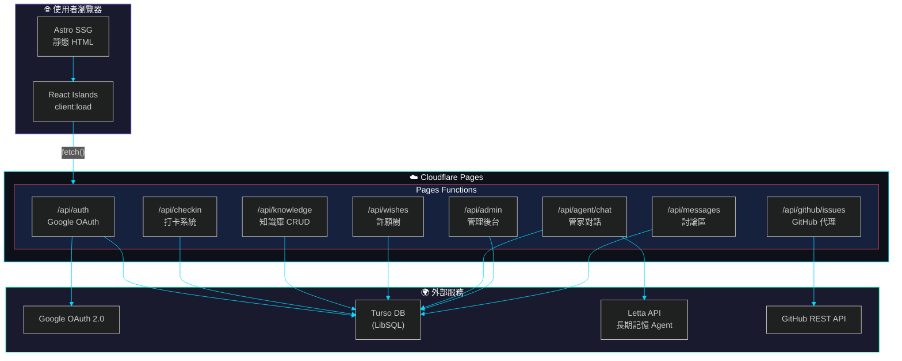
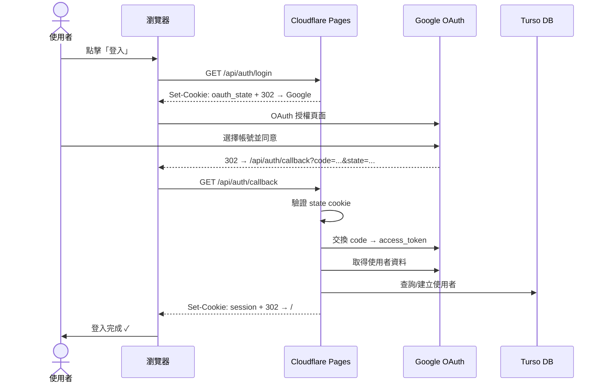
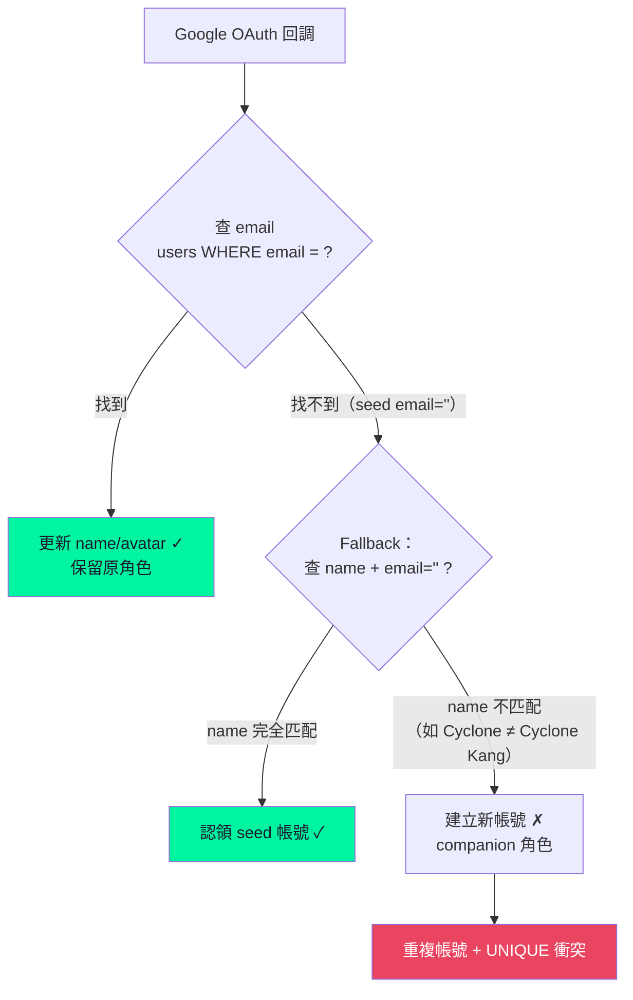
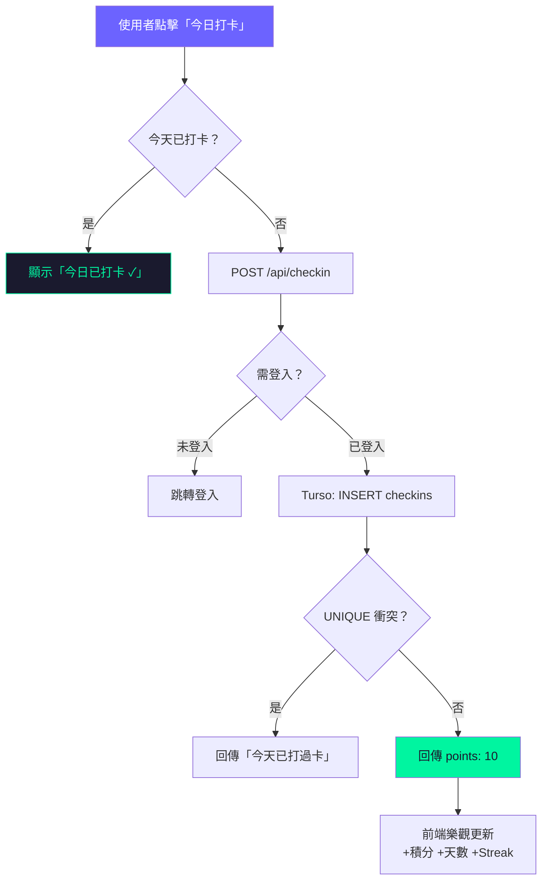
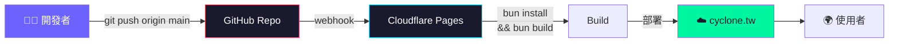
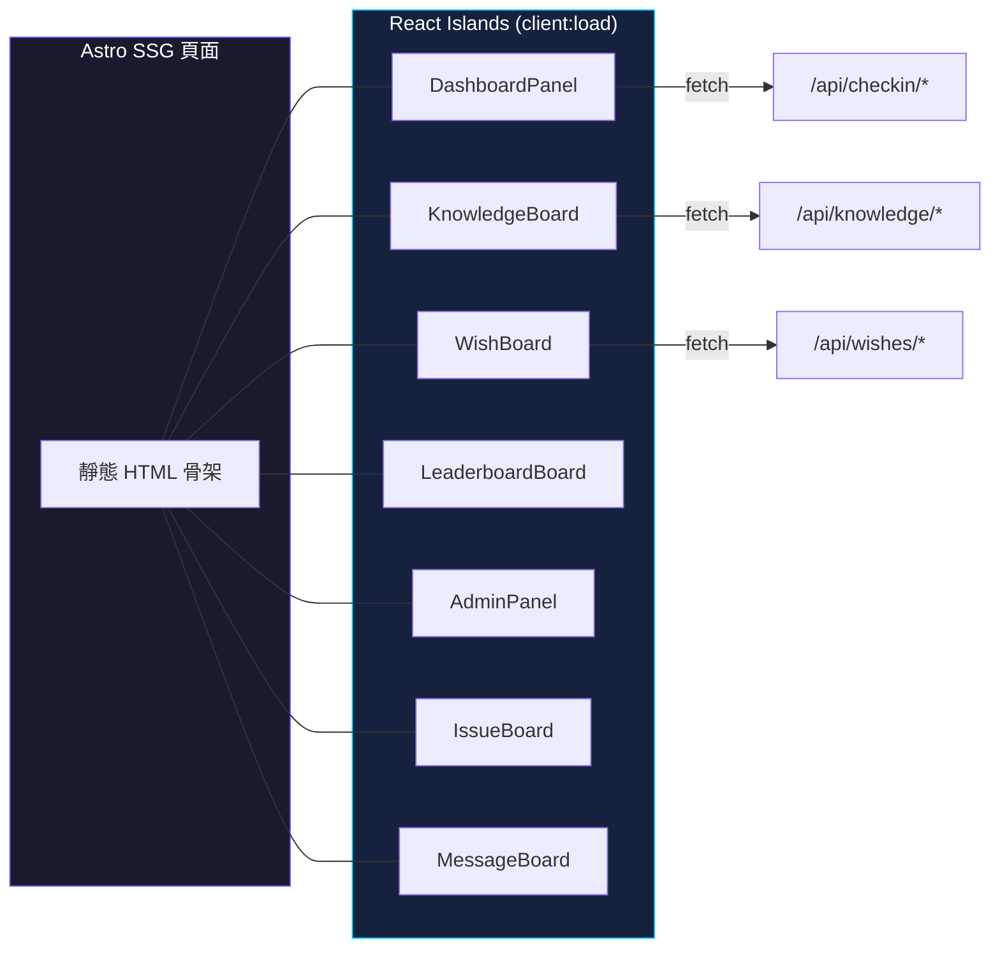

# 架構概覽

> 本頁說明 Cyclone 網站的整體架構：前端用 Astro SSG + React Islands，後端用 Cloudflare Pages Functions，資料庫用 Turso (LibSQL)，認證用 Google OAuth 2.0，AI 管家用 Letta API。

## 系統架構圖



## 技術棧

| 層級 | 技術 | 用途 |
|------|------|------|
| Frontend | Astro 6 + React | SSG 頁面 + React islands |
| Styling | Tailwind CSS v4 | 深色 cyberpunk 主題 + 淺色模式 |
| Backend | Cloudflare Pages Functions | API 端點（`functions/api/`） |
| Database | Turso (LibSQL) | 雲端 SQLite，edge-friendly |
| Auth | Google OAuth 2.0 | 登入/回調/Session |
| AI Agent | Letta API | Cyclone 管家長期記憶 |
| Hosting | Cloudflare Pages | 自動部署（push to main） |

## 目錄結構

```
cyclone-26/
├── functions/api/          # Cloudflare Pages Functions (API)
│   ├── agent/chat.ts       # 管家聊天（Letta 代理）
│   ├── auth/               # OAuth（login/callback/logout/me）
│   ├── checkin/            # 打卡（POST/GET stats/leaderboard）
│   ├── db/init.ts          # Schema 初始化 + migration
│   ├── github/issues.ts    # GitHub Issues 代理
│   ├── admin/              # 管理後台（stats/roles）
│   ├── knowledge/          # 知識庫 CRUD
│   ├── wishes/             # 許願樹 CRUD
│   └── messages/           # 討論區 + 按讚
├── src/
│   ├── components/         # React islands（*.tsx）
│   │   ├── auth/           # useAuth hook + LoginButton
│   │   ├── dashboard/      # 儀表板
│   │   ├── knowledge/      # 知識庫
│   │   ├── wishlist/       # 許願樹
│   │   ├── leaderboard/    # 積分榜
│   │   ├── admin/          # 管理後台
│   │   ├── issues/         # Issue 追蹤
│   │   └── discuss/        # 討論區
│   ├── layouts/            # Astro Layout
│   ├── lib/                # 常數、auth 工具、版本
│   └── pages/              # Astro 頁面（SSG）
├── wiki/                   # GitHub Wiki 文件
└── public/                 # 靜態資源
```

## OAuth 登入流程



## OAuth 已知問題：重複帳號（Issue #22）

Seed 用戶 email 預設為空字串，OAuth callback 以 email 查詢時找不到配對，會建立新的 UUID 帳號。



**Hotfix 已處理**：隊長帳號已合併，email 已更新為 `cyclonetw@gmail.com`。
**長期方案**：見 [Issue #22](https://github.com/cyclone-tw/cyclone-workflow/issues/22)。

## 打卡資料流



## 部署流程



## React Islands 模式

Astro 頁面載入靜態骨架，互動區塊用 React islands 渲染：

```astro
---
// src/pages/dashboard/index.astro
import DashboardPanel from '@/components/dashboard/DashboardPanel';
---
<DashboardPanel client:load />
```

每個 island 獨立管理自己的 state、fetch、UI 更新。


