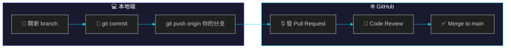

# Claude Code 新手入門

> 剛安裝好 Claude Code，不知道從哪裡開始？這篇帶你 5 分鐘上手，並瞭解 Cyclone 專案的協作慣例。

---

## 第一步：安裝與登入

### 安裝
```bash
npm install -g @anthropic-ai/claude-code
```
> 註：Claude Code 本身透過 npm 發布；Cyclone 專案內則統一使用 **Bun**，禁用 npm / pnpm / yarn。

### 登入
```bash
claude
```
第一次啟動會要求你 **Anthropic Console 登入授權**，照著瀏覽器提示完成即可。

---

## 第二步：進到專案目錄

Cyclone 的 repo 位於：
```bash
git clone https://github.com/cyclone-tw/cyclone-workflow.git
cd cyclone-workflow
claude
```

Claude Code 會自動讀取專案根目錄的設定檔，包括：
- `CLAUDE.md` — Claude Code 專屬規則
- `AGENTS.md` — 所有 AI（Claude / Codex / Gemini）共用規則
- `.claude/` — 本地設定與記憶

---

## 第三步：先讀這三本「聖經」

在你開始改程式碼之前，務必先瞭解這三份文件：

| 文件 | 用途 | 為什麼重要 |
|------|------|-----------|
| [`AGENTS.md`](../AGENTS.md) | 全 AI 共用規則 | 分支命名、PR 流程、禁止直推 main、風格敏感任務誰來做 |
| [`CLAUDE.md`](../CLAUDE.md) | Claude Code 專屬 | Changelog 維護、superpowers 使用時機、subagent 路由 |
| [`wiki/Home.md`](Home) | Wiki 導覽 | 快速找到架構、API、資料庫、權限等文件 |

### 特別注意 🚨
- **禁止直接 `git push` 到 `main`**，所有變更必須開 branch + 發 PR
- **風格敏感的 UI 調整**（文案、配色、微動畫）不建議丟給 subagent，由你親自下指令
- **每次功能變更要同步更新** `src/lib/changelog.ts`

---

## 第四步：常用指令一覽

### 基礎對話
| 指令 | 效果 |
|------|------|
| `claude` | 進入目前目錄的對話模式 |
| `claude "你的指令"` | 單次執行後退出 |
| `/clear` | 清空對話紀錄 |
| `/exit` | 離開 Claude Code |

### 檔案與程式碼
| 指令 | 效果 |
|------|------|
| 直接說「讀 `src/lib/changelog.ts`」 | Claude 會自動讀取 |
| 直接說「修改 `Navbar.tsx` 的標題」 | Claude 會讀檔、修改、回報 diff |
| `/commit` | 互動式產生 commit（推薦） |

### Superpowers 技能（本專案常用）
| 技能 | 何時用 |
|------|--------|
| `/plan` | 有 spec 要實作，先規劃再動工 |
| `/tdd` | 寫新功能或修 bug，先寫測試 |
| `/review-pr` | 完成一段程式碼，請 AI 幫你 review |
| `/debug` | 遇到 bug 或測試失敗，系統化排查 |
| `/verify` | 宣告完成前，請 AI 驗證是否達標 |

---

## 第五步：Cyclone 專案開發流程

```mermaid
%%{init: {'theme': 'dark', 'themeVariables': { 'primaryColor': '#6C63FF', 'primaryTextColor': '#fff', 'primaryBorderColor': '#6C63FF', 'lineColor': '#00D9FF', 'secondaryColor': '#16213e', 'tertiaryColor': '#1a1a2e' }}}%%
graph LR
    Issue["🎫 GitHub Issue"] --> Branch["🌿 開 branch\nfix/29_navbar-desktop-squeeze"]
    Branch --> Dev["💻 開發 + 測試"]
    Dev --> Changelog["📝 更新 changelog.ts"]
    Changelog --> PR["🔃 發 PR Draft"]
    PR --> Review["👀 Code Review"]
    Review --> Merge["✅ Merge to main"]
    Merge --> Deploy["🚀 自動部署"]

    style Issue fill:#1a1a2e,stroke:#E94560,color:#fff
    style Branch fill:#1a1a2e,stroke:#00D9FF,color:#fff
    style Dev fill:#1a1a2e,stroke:#6C63FF,color:#fff
    style PR fill:#1a1a2e,stroke:#4285F4,color:#fff
    style Merge fill:#00F5A0,color:#1a1a2e
    style Deploy fill:#6C63FF,color:#fff
```



### 流程細節
1. **從 Issue 開始**：每個 branch 都要對應一個 issue，名稱開頭加 issue 編號（例：`fix/29_navbar-desktop-squeeze`）
2. **開發中測試**：本地跑 `bun run build` 確認能過
3. **更新 Changelog**：在 `src/lib/changelog.ts` 新增一筆 `ChangelogEntry`
4. **發 PR**：先開 Draft，確認沒問題再轉 Ready for review
5. **Code Review**：Claude Code 的 `/review-pr` 或隊友人工 review
6. **Merge 後自動部署**：push to main 會觸發 Cloudflare Pages 自動部署

---

## 第六步：Git 版控基礎（新手必學）

### 為什麼要用 Git？

Git 就像時光機，記錄你每一次的修改。當你出錯時，隨時可以回到之前的版本。更重要的是，團隊成員可以同時在不同 branch 上工作，不會互相干擾。

### 基本指令

| 指令 | 用途 | 簡單比喻 |
|------|------|----------|
| `git clone <URL>` | 把雲端的程式碼下載到本地 | 複製一份到硬碟 |
| `git pull` | 把遠端的最新變更抓下來 | 更新資料夾裡的檔案 |
| `git status` | 查看目前有哪些修改 | 看現在改了多少東西 |
| `git add <檔案>` | 把檔案加入「待提交」區 | 放進購物車 |
| `git commit -m "訊息"` | 正式儲存這次修改 | 結帳，寫下購買記錄 |
| `git push` | 把本地的 commit 推到雲端 | 把結帳記錄上傳到雲端 |

### 分支（Branch）是什麼？

分支就像平行宇宙——你在新分支上的修改不會影響別人，確認沒問題後再合併回主線。

```
main ────────────────────────────────────► (正式版本)
         │
         └── fix/29_navbar-desktop-squeeze ──► (修復中的版本)
```

| 指令 | 用途 |
|------|------|
| `git branch` | 列出所有分支 |
| `git checkout -b fix/29_navbar-desktop-squeeze` | 新建並切換到一個新分支 |
| `git checkout main` | 切換回 main 分支 |
| `git merge fix/29_navbar-desktop-squeeze` | 把其他分支的修改合併進來 |

### Cyclone 專案的分支命名慣例

```
{type}/{issue-number}_{description}
```

| type | 用途 | 範例 |
|------|------|------|
| `fix/` | 修復 bug | `fix/29_navbar-desktop-squeeze` |
| `feat/` | 新功能 | `feat/30_dashboard-enhancements` |
| `docs/` | 文件更新 | `docs/54_claude-code-101` |
| `chore/` | 杂项（工具、整理） | `chore/update-deps` |

### PR（Pull Request）流程



**詳細步驟：**
1. `git checkout -b fix/29_navbar-desktop-squeeze` — 開新分支
2. 正常修改檔案
3. `git add .` — 加入待提交（`.` 代表所有修改）
4. `git commit -m "fix: 修復 Navbar 桌面版擠壓問題"` — 提交
5. `git push origin fix/29_navbar-desktop-squeeze` — 推到 GitHub
6. 在 GitHub 上發 Pull Request（PR）
7. 等待 Code Review，通過後 Merge

### 🚨 重要紀律

> **本專案禁用 npm / pnpm / yarn，統一使用 `bun` / `bunx`！**
>
> - ✅ `bun install`、`bun run build`、`bun run dev`
> - ❌ `npm install`、`npm run build`、`yarn dev`

---

## 第七步：SDD（Spec-Driven Development）流程

### SDD 是什麼？

SDD = **Spec-Driven Development**（規格驅動開發）。核心理念是：**先寫規格（Spec），再寫程式碼**。

就像蓋房子之前要先畫藍圖，寫程式之前要先明確「這個功能要達成什麼目標、輸入是什麼、輸出是什麼」。

### SDD 的核心精神

| 傳統方式 | SDD 方式 |
|----------|----------|
| 拿到需求就開始寫 code | 先把需求寫成文件 / 規格 |
| 做到一半才發現理解錯誤 | 規格確認後才動手 |
| 最後才發現不符合需求 | 一開始就對焦目標 |
| code 改來改去、浪費時間 | 減少返工、提高品質 |

### 在 Cyclone 專案中實踐 SDD

Cyclone 結合 SDD 和 Claude Code 的 superpowers，讓 AI 幫你貫徹流程：

```mermaid
%%{init: {'theme': 'dark', 'themeVariables': { 'primaryColor': '#6C63FF', 'primaryTextColor': '#fff', 'primaryBorderColor': '#6C63FF', 'lineColor': '#00D9FF', 'secondaryColor': '#16213e', 'tertiaryColor': '#1a1a2e' }}}%%
flowchart LR
    I["🎫 開 Issue\n描述需求"] --> P["📋 /plan\n規劃實作方案"]
    P --> T["🧪 /tdd\n先寫測試規格"]
    T --> C["💻 寫實作\n通過測試"]
    C --> V["✅ /verify\n驗證完成度"]
    V --> R["👀 /review-pr\nCode Review"]
    R --> M["🚀 Merge + Deploy"]

    style I fill:#1a1a2e,stroke:#E94560,color:#fff
    style P fill:#1a1a2e,stroke:#4285F4,color:#fff
    style T fill:#1a1a2e,stroke:#00F5A0,color:#fff
    style C fill:#1a1a2e,stroke:#6C63FF,color:#fff
    style V fill:#1a1a2e,stroke:#F5A000,color:#fff
    style R fill:#1a1a2e,stroke:#00D9FF,color:#fff
    style M fill:#00F5A0,color:#1a1a2e
```



#### 步驟一：開 GitHub Issue 描述需求

在動手之前，先在 GitHub Issues 建立一個 issue，清楚描述：
- **要解決什麼問題？**
- **期望的行為是什麼？**
- **驗收標準（怎麼算完成？）**

#### 步驟二：用 `/plan` 規劃實作方案

```bash
/plan
```

在 Claude Code 裡執行 `/plan`，告訴它你要實作的功能。`/plan` 會：
- 分析現有程式碼結構
- 規劃實作步驟
- 列出需要修改的檔案

> **這樣做的好處**：在動手之前，先讓 AI 幫你確認方向是否正確，避免做到一半才發現架構不合。

#### 步驟三：用 `/tdd` 先寫測試再寫實作

```bash
/tdd
```

`/tdd` 會引導你先寫**測試規格**（describe + it），確認測試失敗，然後才寫實作讓測試通過。

#### 步驟四：用 `/verify` 驗證完成度

```bash
/verify
```

在宣告功能完成之前，執行 `/verify` 讓 AI 檢查：
- 測試是否都通過了？
- 功能是否達到了規格要求？
- 是否有遺漏的 edge case？

#### 步驟五：發 PR 並跑 `/review-pr`

```bash
/review-pr
```

在 GitHub 發 PR 後，用 `/review-pr` 請 AI 幫你做 Code Review，檢查：
- 邏輯是否正確
- 是否有安全漏洞
- 是否符合專案風格

### 為什麼要用 SDD？

| 好處 | 說明 |
|------|------|
| **減少返工** | 先確認規格，避免做到一半發現方向錯了 |
| **提高品質** | TDD 讓你一開始就考慮 edge case |
| **協作更順暢** | AI 和人類都能看懂規格，減少溝通誤解 |
| **驗收有依據** | 有明確的標準，什麼叫「完成」不會各說各話 |
| **記錄傳承** | Issue + PR 就是完整的開發歷程，新人也能看懂 |

### 一句話總結 SDD

> **先想清楚再做，做完要能驗證。**

---

## 第八步：遇到問題怎麼辦？

| 狀況 | 解決方式 |
|------|----------|
| 不知道某個功能在哪 | 問 Claude：「許願樹的 API 在哪裡？」 |
| 想瞭解資料表結構 | 看 [`wiki/Database.md`](Database) 或問 Claude |
| build 失敗 | 把錯誤訊息貼給 Claude，或跑 `/debug` |
| 不確定某個改法對不對 | 先發 PR Draft，再跑 `/review-pr` |
| 要備份資料庫 | `.dev.vars` 指向 prod，動 DB 前務必先備份 |

---

## 快速查詢表

### 專案資訊
| 項目 | 內容 |
|------|------|
| 技術棧 | Astro + React + TypeScript + Cloudflare Pages |
| 資料庫 | Turso (LibSQL) |
| 部署 | push to main → Cloudflare Pages |
| 線上網站 | https://cyclone.tw |

### 關鍵檔案
| 檔案 | 用途 |
|------|------|
| `src/lib/changelog.ts` | 線上 Changelog 的資料來源 |
| `src/lib/version.ts` | 版本號（自動更新，勿手動改） |
| `functions/api/` | Cloudflare Pages Functions API |
| `src/components/` | React 元件 |
| `wiki/` | 本 Wiki 所有頁面 |

---

*歡迎加入 Cyclone 開發！有問題直接在 Discord 或 GitHub Issues 發問。*
