# Claude Code 新手入門

> 剛安裝好 Claude Code，不知道從哪裡開始？這篇帶你 5 分鐘上手，並瞭解 Cyclone 專案的協作慣例。

---

## 第一步：安裝與登入

### 安裝
```bash
npm install -g @anthropic-ai/claude-code
```
> 註：Claude Code 本身透過 npm 發布；Cyclone 專案內則統一使用 **Bun**，禁用 npm / pnpm / yarn。

### 登入
```bash
claude
```
第一次啟動會要求你 **Anthropic Console 登入授權**，照著瀏覽器提示完成即可。

---

## 第二步：進到專案目錄

Cyclone 的 repo 位於：
```bash
git clone https://github.com/cyclone-tw/cyclone-workflow.git
cd cyclone-workflow
claude
```

Claude Code 會自動讀取專案根目錄的設定檔，包括：
- `CLAUDE.md` — Claude Code 專屬規則
- `AGENTS.md` — 所有 AI（Claude / Codex / Gemini）共用規則
- `.claude/` — 本地設定與記憶

---

## 第三步：先讀這三本「聖經」

在你開始改程式碼之前，務必先瞭解這三份文件：

| 文件 | 用途 | 為什麼重要 |
|------|------|-----------|
| [`AGENTS.md`](../AGENTS.md) | 全 AI 共用規則 | 分支命名、PR 流程、禁止直推 main、風格敏感任務誰來做 |
| [`CLAUDE.md`](../CLAUDE.md) | Claude Code 專屬 | Changelog 維護、superpowers 使用時機、subagent 路由 |
| [`wiki/Home.md`](Home) | Wiki 導覽 | 快速找到架構、API、資料庫、權限等文件 |

### 特別注意 🚨
- **禁止直接 `git push` 到 `main`**，所有變更必須開 branch + 發 PR
- **風格敏感的 UI 調整**（文案、配色、微動畫）不建議丟給 subagent，由你親自下指令
- **每次功能變更要同步更新** `src/lib/changelog.ts`

---

## 第四步：常用指令一覽

### 基礎對話
| 指令 | 效果 |
|------|------|
| `claude` | 進入目前目錄的對話模式 |
| `claude "你的指令"` | 單次執行後退出 |
| `/clear` | 清空對話紀錄 |
| `/exit` | 離開 Claude Code |

### 檔案與程式碼
| 指令 | 效果 |
|------|------|
| 直接說「讀 `src/lib/changelog.ts`」 | Claude 會自動讀取 |
| 直接說「修改 `Navbar.tsx` 的標題」 | Claude 會讀檔、修改、回報 diff |
| `/commit` | 互動式產生 commit（推薦） |

### Superpowers 技能（本專案常用）
| 技能 | 何時用 |
|------|--------|
| `/plan` | 有 spec 要實作，先規劃再動工 |
| `/tdd` | 寫新功能或修 bug，先寫測試 |
| `/review-pr` | 完成一段程式碼，請 AI 幫你 review |
| `/debug` | 遇到 bug 或測試失敗，系統化排查 |
| `/verify` | 宣告完成前，請 AI 驗證是否達標 |

---

## 第五步：Cyclone 專案開發流程

```mermaid
%%{init: {'theme': 'dark', 'themeVariables': { 'primaryColor': '#6C63FF', 'primaryTextColor': '#fff', 'primaryBorderColor': '#6C63FF', 'lineColor': '#00D9FF', 'secondaryColor': '#16213e', 'tertiaryColor': '#1a1a2e' }}}%%
graph LR
    Issue["🎫 GitHub Issue"] --> Branch["🌿 開 branch\nfix/29_navbar-desktop-squeeze"]
    Branch --> Dev["💻 開發 + 測試"]
    Dev --> Changelog["📝 更新 changelog.ts"]
    Changelog --> PR["🔃 發 PR Draft"]
    PR --> Review["👀 Code Review"]
    Review --> Merge["✅ Merge to main"]
    Merge --> Deploy["🚀 自動部署"]

    style Issue fill:#1a1a2e,stroke:#E94560,color:#fff
    style Branch fill:#1a1a2e,stroke:#00D9FF,color:#fff
    style Dev fill:#1a1a2e,stroke:#6C63FF,color:#fff
    style PR fill:#1a1a2e,stroke:#4285F4,color:#fff
    style Merge fill:#00F5A0,color:#1a1a2e
    style Deploy fill:#6C63FF,color:#fff
```



### 流程細節
1. **從 Issue 開始**：每個 branch 都要對應一個 issue，名稱開頭加 issue 編號（例：`fix/29_navbar-desktop-squeeze`）
2. **開發中測試**：本地跑 `bun run build` 確認能過
3. **更新 Changelog**：在 `src/lib/changelog.ts` 新增一筆 `ChangelogEntry`
4. **發 PR**：先開 Draft，確認沒問題再轉 Ready for review
5. **Code Review**：Claude Code 的 `/review-pr` 或隊友人工 review
6. **Merge 後自動部署**：push to main 會觸發 Cloudflare Pages 自動部署

---

## 第六步：遇到問題怎麼辦？

| 狀況 | 解決方式 |
|------|----------|
| 不知道某個功能在哪 | 問 Claude：「許願樹的 API 在哪裡？」 |
| 想瞭解資料表結構 | 看 [`wiki/Database.md`](Database) 或問 Claude |
| build 失敗 | 把錯誤訊息貼給 Claude，或跑 `/debug` |
| 不確定某個改法對不對 | 先發 PR Draft，再跑 `/review-pr` |
| 要備份資料庫 | `.dev.vars` 指向 prod，動 DB 前務必先備份 |

---

## 快速查詢表

### 專案資訊
| 項目 | 內容 |
|------|------|
| 技術棧 | Astro + React + TypeScript + Cloudflare Pages |
| 資料庫 | Turso (LibSQL) |
| 部署 | push to main → Cloudflare Pages |
| 線上網站 | https://cyclone.tw |

### 關鍵檔案
| 檔案 | 用途 |
|------|------|
| `src/lib/changelog.ts` | 線上 Changelog 的資料來源 |
| `src/lib/version.ts` | 版本號（自動更新，勿手動改） |
| `functions/api/` | Cloudflare Pages Functions API |
| `src/components/` | React 元件 |
| `wiki/` | 本 Wiki 所有頁面 |

---

*歡迎加入 Cyclone 開發！有問題直接在 Discord 或 GitHub Issues 發問。*
