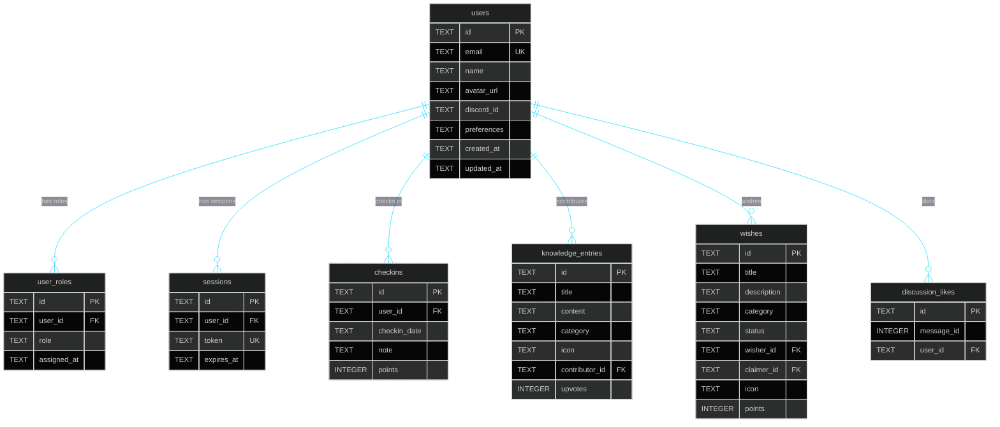
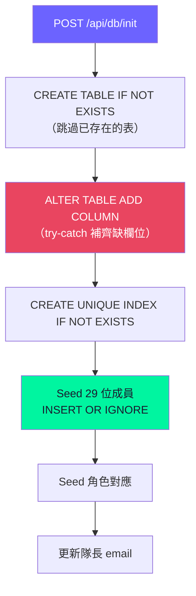

# 資料庫 Schema

> Turso (LibSQL) — 雲端 SQLite，edge-friendly 的分佈式資料庫。資料庫名稱：`cyclone-26`，Region：aws-ap-northeast-1。部署時自動初始化（`POST /api/db/init`），支援 migration 補欄機制。

## ER 圖



## 表結構

### `users` — 使用者

| 欄位 | 型態 | 說明 |
|------|------|------|
| id | TEXT PK | 使用者 ID（種子用戶為簡稱，新用戶為 UUID） |
| email | TEXT | Google 帳號 email（UNIQUE） |
| name | TEXT | 顯示名稱 |
| avatar_url | TEXT | Google 頭像 URL |
| discord_id | TEXT | Discord ID（保留） |
| preferences | TEXT | JSON 偏好設定 |
| created_at | TEXT | 建立時間 |
| updated_at | TEXT | 更新時間 |

### `user_roles` — 角色對應

| 欄位 | 型態 | 說明 |
|------|------|------|
| id | TEXT PK | UUID |
| user_id | TEXT FK → users | 使用者 |
| role | TEXT | captain / tech / admin / member / companion |
| assigned_at | TEXT | 指派時間 |

UNIQUE(user_id, role)

### `sessions` — 登入 Session

| 欄位 | 型態 | 說明 |
|------|------|------|
| id | TEXT PK | UUID |
| user_id | TEXT FK → users | 使用者 |
| token | TEXT UNIQUE | Session token |
| expires_at | TEXT | 過期時間 |
| created_at | TEXT | 建立時間 |

### `checkins` — 每日打卡

| 欄位 | 型態 | 說明 |
|------|------|------|
| id | TEXT PK | UUID |
| user_id | TEXT FK → users | 使用者 |
| checkin_date | TEXT | 日期 `YYYY-MM-DD`（本地時間） |
| note | TEXT | 打卡備註 |
| points | INTEGER | 獲得積分（預設 10） |
| created_at | TEXT | 建立時間 |

UNIQUE(user_id, checkin_date)

### `knowledge_entries` — 知識庫

| 欄位 | 型態 | 說明 |
|------|------|------|
| id | TEXT PK | UUID |
| title | TEXT | 標題 |
| content | TEXT | 內容 |
| category | TEXT | template / best-practice / qa / other |
| icon | TEXT | 圖示 emoji |
| contributor_id | TEXT FK → users | 貢獻者 |
| upvotes | INTEGER | 讚數 |
| created_at | TEXT | 建立時間 |
| updated_at | TEXT | 更新時間 |

### `wishes` — 許願樹

| 欄位 | 型態 | 說明 |
|------|------|------|
| id | TEXT PK | UUID |
| title | TEXT | 願望標題 |
| description | TEXT | 描述 |
| category | TEXT | personal / site |
| status | TEXT | pending → claimed → in-progress → completed |
| wisher_id | TEXT FK → users | 許願者 |
| claimer_id | TEXT FK → users | 認領者 |
| icon | TEXT | 圖示 emoji |
| points | INTEGER | 積分 |
| created_at | TEXT | 建立時間 |
| updated_at | TEXT | 更新時間 |

### `discussion_likes` — 討論區按讚

| 欄位 | 型態 | 說明 |
|------|------|------|
| id | TEXT PK | UUID |
| message_id | INTEGER | 訊息 ID |
| user_id | TEXT FK → users | 按讚者 |
| created_at | TEXT | 按讚時間 |

UNIQUE(message_id, user_id)

### 其他表

- `memories` — Agent 記憶（type: fact/preference/goal/skill/interaction）
- `conversations` — Agent 對話紀錄
- `weekly_progress` — 每週進度
- `shared_knowledge` — 共享知識（舊版，已由 knowledge_entries 取代）
- `tags` / `resource_tags` — 標籤系統

## 許願樹狀態流

```mermaid
stateDiagram-v2
    [*] --> pending : 許願
    pending --> claimed : 有人認領
    pending --> [*] : 許願者刪除
    claimed --> in_progress : 開始實作
    claimed --> pending : 取消認領
    in_progress --> completed : 完成實作
    in_progress --> claimed : 暫停實作
    completed --> [*]

    state pending {
        note right of pending: 任何人可認領
    }
    state completed {
        note right of completed: 認領者獲得積分
    }
```

## Migration 流程



## 查詢

用 Turso CLI 查詢：
```bash
turso db shell cyclone-26 ".schema users"
turso db shell cyclone-26 "SELECT * FROM users LIMIT 5"
```
