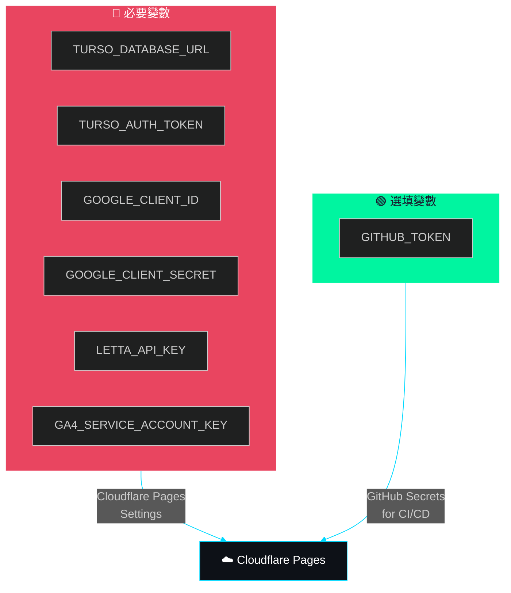

# 環境變數

> 所有部署所需 secrets 與設定。必要變數（Google OAuth、Turso DB、Letta API）在 Cloudflare Pages Settings 中加密儲存，選填變數（GITHUB_TOKEN）可在缺少時使用 anonymous 模式。



---

## Cloudflare Pages 設定

在 Cloudflare Dashboard → Pages → cyclone-workflow → Settings → Environment variables 設定。

### 必要

| 變數 | 說明 | 範例 |
|------|------|------|
| `TURSO_DATABASE_URL` | Turso 資料庫連線 URL | `libsql://cyclone-26-xxx.turso.io` |
| `TURSO_AUTH_TOKEN` | Turso 認証 token | `eyJhbG...` |
| `GOOGLE_CLIENT_ID` | Google OAuth Client ID | `xxx.apps.googleusercontent.com` |
| `GOOGLE_CLIENT_SECRET` | Google OAuth Client Secret | `GOCSPX-xxx` |
| `LETTA_API_KEY` | Letta Agent API Key | `letta-xxx` |
| `GA4_SERVICE_ACCOUNT_KEY` | GA4 Service Account JSON（全文，無需包成一行） | `{"type":"service_account",...}` |
| `GA4_PROPERTY_ID` | GA4 Numeric Property ID（非 Measurement ID！） | `459274837` |

### 選用

| 變數 | 說明 | 預設 |
|------|------|------|
| `GITHUB_TOKEN` | GitHub PAT（提高 API 限額） | 無（使用 anonymous，60 req/hr） |

## Google OAuth 設定

1. 前往 [Google Cloud Console](https://console.cloud.google.com/apis/credentials)
2. 建立 OAuth 2.0 Client ID
3. Authorized redirect URIs 加入：
   - `https://cyclone.tw/api/auth/callback`
   - `http://localhost:4321/api/auth/callback`（本地開發）

## Google Analytics 設定

GA4 Data API 使用 Service Account 認證（無需 OAuth user 互動）。

1. 前往 [Google Cloud Console](https://console.cloud.google.com/apis/credentials) → **建立 Service Account**
2. 建立 JSON Key，下載後將內容設定為 `GA4_SERVICE_ACCOUNT_KEY` 環境變數
3. 在 **Google Analytics Admin** → **Account Access Management** 將 Service Account email（`xxx@yyy.iam.gserviceaccount.com`）加入並給予 **Viewer** 權限
4. 確認 GA4 Numeric Property ID（**不是** Measurement ID `G-WE3VKBPWJ9`！），可在 GA4 Admin → **Account Settings** 或 **Property Settings** 找到，格式如 `459274837`
5. 在 `functions/api/admin/analytics.ts` 中將 `GA4_PROPERTY_ID` 替換為上述 Numeric Property ID，或透過 Cloudflare Pages 環境變數 `GA4_PROPERTY_ID` 設定

## 本地開發

```bash
# .env（Bun 自動載入）
TURSO_DATABASE_URL=libsql://...
TURSO_AUTH_TOKEN=eyJ...
GOOGLE_CLIENT_ID=xxx.apps.googleusercontent.com
GOOGLE_CLIENT_SECRET=GOCSPX-xxx
LETTA_API_KEY=letta-xxx
# GA4 Service Account JSON（貼上完整 JSON，無需序列化為一行）
GA4_SERVICE_ACCOUNT_KEY='{"type":"service_account",...}'
# GA4 Numeric Property ID（非 Measurement ID，可在 GA4 Admin → Property Settings 找到）
GA4_PROPERTY_ID=459274837
```

```bash
bun run dev     # 啟動開發伺服器
bun run build   # 建置
```

## 部署流程

```
git push origin main
    → Cloudflare Pages 偵測到 push
    → 自動 bun install && bun run build
    → 部署到 cyclone.tw
```
