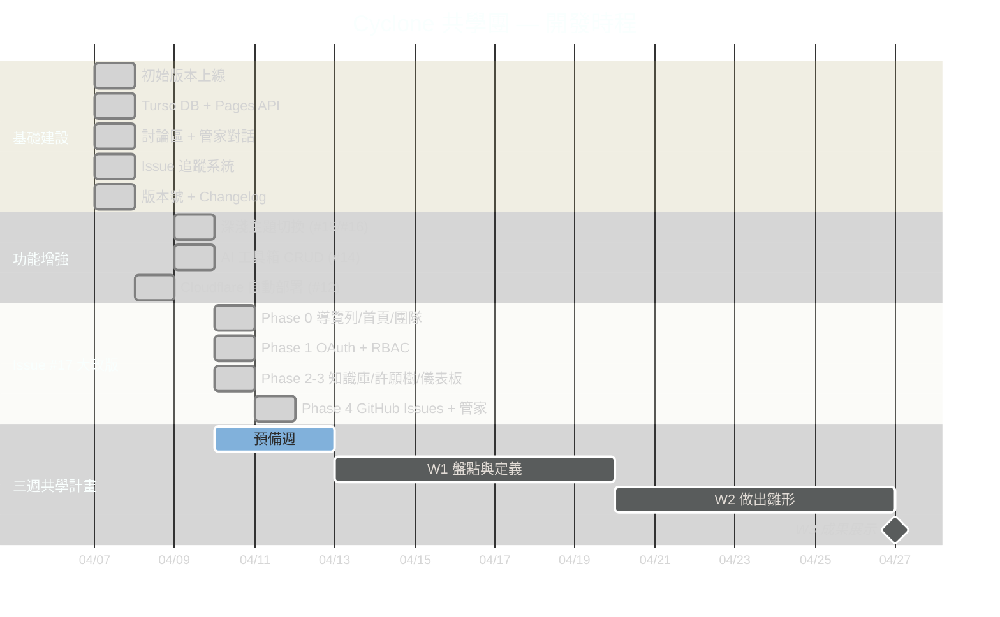

# 甘特圖時程

_最後更新：2026-04-11_

> 本頁追蹤所有 Cyclone 網站的 Issue 與開發時程。分為三大部分：已完成（10 個）、開發時程甘特圖、以及 Issue #17 大改版階段圖。

---

---

## Issue #17 階段完成圖

```mermaid
%%{init: {'theme': 'dark', 'themeVariables': { 'primaryColor': '#6C63FF', 'primaryTextColor': '#fff', 'primaryBorderColor': '#6C63FF', 'lineColor': '#00D9FF', 'secondaryColor': '#16213e', 'tertiaryColor': '#1a1a2e' }}}%%
flowchart LR
    subgraph Phase0["Phase 0"]
        A1["導覽列改版"] 
        A2["首頁改版"]
        A3["團隊頁改版"]
    end

    subgraph Phase1["Phase 1"]
        B1["Google OAuth"]
        B2["RBAC 權限"]
        B3["每日打卡"]
    end

    subgraph Phase23["Phase 2-3"]
        C1["知識庫 CRUD"]
        C2["許願樹"]
        C3["儀表板"]
        C4["積分榜"]
        C5["管理後台"]
        C6["討論區按讚"]
    end

    subgraph Phase4["Phase 4"]
        D1["GitHub Issues"]
        D2["管家 Persona"]
        D3["管家同步機制"]
    end

    Phase0 --> Phase1 --> Phase23 --> Phase4

    style Phase0 fill:#1a1a2e,stroke:#6C63FF,color:#fff
    style Phase1 fill:#1a1a2e,stroke:#00D9FF,color:#fff
    style Phase23 fill:#1a1a2e,stroke:#00F5A0,color:#fff
    style Phase4 fill:#1a1a2e,stroke:#A78BFA,color:#fff
```

---

## 依標籤分組

### ✅ 已完成 (10)
[#17](https://github.com/cyclone-tw/cyclone-workflow/issues/17) · [#16](https://github.com/cyclone-tw/cyclone-workflow/issues/16) · [#15](https://github.com/cyclone-tw/cyclone-workflow/issues/15) · [#14](https://github.com/cyclone-tw/cyclone-workflow/issues/14) · [#12](https://github.com/cyclone-tw/cyclone-workflow/issues/12) · [#10](https://github.com/cyclone-tw/cyclone-workflow/issues/10) · [#9](https://github.com/cyclone-tw/cyclone-workflow/issues/9) · [#8](https://github.com/cyclone-tw/cyclone-workflow/issues/8) · [#7](https://github.com/cyclone-tw/cyclone-workflow/issues/7) · [#1](https://github.com/cyclone-tw/cyclone-workflow/issues/1)

### 🟢 等待中 (6)
- [#23](https://github.com/cyclone-tw/cyclone-workflow/issues/23) — Google Analytics 顯示與分析後台 + AI 建議功能
- [#22](https://github.com/cyclone-tw/cyclone-workflow/issues/22) — OAuth 登入產生重複帳號 + Email UNIQUE 衝突
- [#6](https://github.com/cyclone-tw/cyclone-workflow/issues/6) — CMS 與 Notion 整合
- [#5](https://github.com/cyclone-tw/cyclone-workflow/issues/5) — 隱私與資料安全
- [#4](https://github.com/cyclone-tw/cyclone-workflow/issues/4) — 缺少資料待提供
- [#3](https://github.com/cyclone-tw/cyclone-workflow/issues/3) — 專案用詞與內容更新
