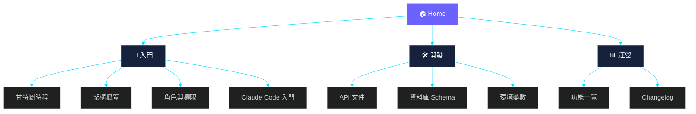

# Cyclone 共學團 Wiki

> 本頁是 Cyclone 網站的首頁導覽，整理所有文件入口與團隊成員一目瞭然。

---

**Cyclone 龍捲風共學團** — 雷蒙三十生活黑客社群的 AI 工作流共學團
> 網站：https://cyclone.tw

## 專案文件

### 入門
- [Claude Code 入門](Claude-Code-101) — 剛安裝好 Claude Code 必讀
- [甘特圖時程](Gantt) — Issue 追蹤與時程規劃
- [架構概覽](Architecture) — 技術棧、目錄結構、資料流
- [角色與權限](Roles) — RBAC 階級與功能對應

### 開發
- [API 文件](API) — 所有 API 端點與參數
- [資料庫 Schema](Database) — Turso 表結構與 migration
- [環境變數](Environment) — 部署所需 secrets 與 config

### 運營
- [功能一覽](Features) — 網站所有頁面與功能說明
- [Changelog](https://cyclone.tw/changelog/) — 線上版本紀錄

## 快速連結

| 項目 | 連結 |
|------|------|
| GitHub | https://github.com/cyclone-tw/cyclone-workflow |
| 線上網站 | https://cyclone.tw |
| Issue 追蹤 | https://github.com/cyclone-tw/cyclone-workflow/issues |
| Turso DB | `cyclone-26` (aws-ap-northeast-1) |

## 團隊

- **隊長**：Cyclone (#2707)
- **技術維護**：Dar (#3808)、Benben
- **行政協作**：Tiffanyhou (#2623)、珊迪
- **正式隊員** × 5、**陪跑員** × 18

_共 29 位成員_
