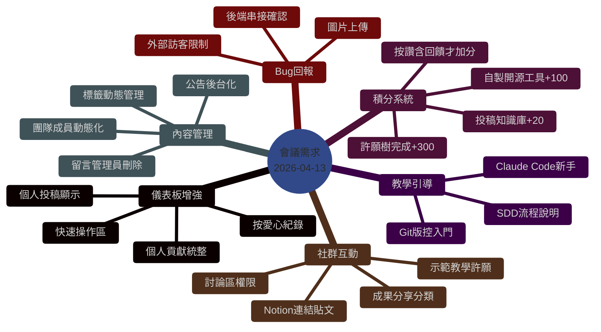
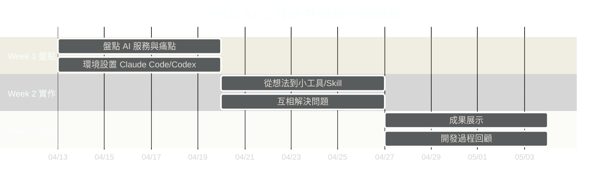

# 2026-04-13 共學團啟動會議

> 26'Q2 AI 工作流共學團正式啟動會議。本頁整理會議重點、三週時程、積分規則、新手引導核心要點，以及延伸出的 GitHub Issues。
>
> **完整追蹤 issue**: [#55](https://github.com/cyclone-tw/cyclone-workflow/issues/55)

## 📅 基本資訊

| 項目 | 內容 |
|---|---|
| 日期 | 2026-04-13 21:30 (UTC+8) |
| 時長 | 約 2 小時 |
| 主題 | 技能自動化與社群互動會議 — 26'Q2 共學團啟動 |
| 主持 | Cyclone (隊長) |
| 主要講者 | Cyclone、達哥、Tiffany、雷蒙/蛋糕、Lyson |
| 與會 | 正式隊員 + 陪跑員 + 訓練營同學 |

## 🎯 會議主軸

1. 共學團三週時程啟動
2. 網站功能需求盤點（儀表板 / 積分 / 討論區 / 管理後台）
3. 積分機制設計（投稿、按讚、開源、許願樹）
4. 新手引導（Git 版控 / Claude Code / SDD 流程）

## 🗺️ 需求心智圖

## 📆 三週共學時程

### Week 1 — 盤點與發想 (4/13-4/19)

**目標**: 盤點自己的工具與痛點

**作業清單**（每位隊員）:
- [ ] 盤點訂閱的 AI 服務與額度（Claude / Codex / Gemini / ChatGPT / Felo…）
- [ ] 確認 Claude Code / Codex CLI 已安裝
- [ ] 列出最痛的痛點 + 想做什麼
- [ ] 發表到「討論區 → 成果分享」或個人 dashboard

### Week 2 — 實作 (4/20-4/26)

**目標**: 從想法進入實作，產出具體小工具或 Skill

- 有想法的同學開始實作
- 卡關的可請教高手
- 互相解決問題、分享進度

### Week 3 — 展示 (4/27-5/3)

**目標**: 正式展示三週成果

- 展示小專案 / 工具 / Skill
- 分享開發過程與踩坑
- 彼此點亮、回顧成長

## 💯 積分機制設計 (初稿)

| 動作 | 分數 | 備註 |
|---|---|---|
| 每日打卡 | +1 | 已上線 |
| 投稿知識庫 | +20 | 待實作 |
| 按讚 + 留下回饋 | 雙方各 +5 | 必須有回饋文字 |
| 投稿 AI 工具 | +50 | 待實作 |
| 自製開源 / 部署網頁 | +100 | 需審核 |
| 工具獲得一個讚 | +20 | 每讚 |
| 完成許願樹許願 | +300 | 實現者 |

**排行榜**: 週榜 / 月榜 / 總榜（會議中 Cyclone 提到前三名上台展示）

**反作弊**:
- 不能 self-like
- 按讚必須留下實質回饋
- 開源獎勵需 admin 審核

> 詳細實作追蹤: [#49](https://github.com/cyclone-tw/cyclone-workflow/issues/49)

## 🆕 會議延伸 Issues

| Issue | 標題 | 優先 | 狀態 |
|---|---|---|---|
| [#49](https://github.com/cyclone-tw/cyclone-workflow/issues/49) | feat: 個人儀表板 + 積分系統全面實作 [Mega] | 🔴 高 | Open |
| [#50](https://github.com/cyclone-tw/cyclone-workflow/issues/50) | feat: 後台動態化 — 標籤 + 團隊成員 [Mega] | 🟡 中 | Open |
| [#51](https://github.com/cyclone-tw/cyclone-workflow/issues/51) | feat: 討論區管理增強 | 🔴 高 | Open |
| [#52](https://github.com/cyclone-tw/cyclone-workflow/issues/52) | fix: Bug 回報表單稽核 + 圖片上傳 | 🟡 中 | Open |
| [#53](https://github.com/cyclone-tw/cyclone-workflow/issues/53) | feat: 共學示範 / 教學許願子系統 | 🟢 低 | Open |
| [#54](https://github.com/cyclone-tw/cyclone-workflow/issues/54) | docs: 新手引導 — Git / Claude Code / SDD | 🟡 中 | Open |
| [#55](https://github.com/cyclone-tw/cyclone-workflow/issues/55) | docs: 會議記錄 + 需求追蹤 (meta) | — | Open |

**進行中**: [#47](https://github.com/cyclone-tw/cyclone-workflow/issues/47) 留言區權限控制

## 🎓 新手引導核心要點

會議中達哥、Lyson、Cyclone 反覆強調的新手關鍵要點:

### 1. 先確認痛點，不要為了做而做

> Cyclone: 「需求要明確 …… 把你想要哪些資料從哪裡去哪裡來。」

### 2. 時間成本 vs 金錢成本

> 雷蒙/蛋糕: 「我愿意花每個月六百多塊的錢去讓它自動帮我完成這些事情嗎？如果說我的話不會，因為我的時薪比它還要便宜很多。」

**原則**: 如果累積每天要花 2~3 小時處理一件重複工作，大於時薪時 → 才值得做自動化。

### 3. 從小工具開始

- 第一步做「AI 垃圾」也是練習
- GAS (Google Apps Script) + Clasp 是輕量起點
- Discord Bot 是很好的互動練習

### 4. SDD 開發流程

1. 先用**網頁版** Claude / Gemini 討論規格（省 token）
2. 產出清楚的 spec
3. 再交給 Claude Code / Codex CLI 實作

### 5. Git 版控救命

> 達哥: 「第一個版本做完之後，你就需要把它推上去 …… 如果出問題了，你就只要跟你的 AI 說幫我把上一個版本弄下來。」

- **不要 force push**
- 每個版本 = 可回溯的備份
- API Key 絕不能推到 public repo（`.env` + `gitignore`）

### 6. 公開 vs 私有 repo

- **靜態 / 教學 / 無敏感**: 設 public，可用 GitHub Pages
- **有資料庫 / API Key / 商業邏輯**: 設 private，用 Zeabur / Railway / Cloudflare Pages 部署

## 🛠️ 會議中提到的工具/技術清單

| 工具 | 用途 | 推薦程度 |
|---|---|---|
| Claude Code | 主力 coding agent | ⭐⭐⭐⭐⭐ |
| Codex CLI | 備用 / 補位 | ⭐⭐⭐⭐ |
| Gemini (網頁版) | 討論規格、省 token | ⭐⭐⭐⭐ |
| Obsidian | 個人知識庫 | ⭐⭐⭐⭐⭐ |
| Notion | 資料庫 + 記錄 | ⭐⭐⭐⭐ |
| Discord | 社群互動（不計量） | ⭐⭐⭐⭐⭐ |
| Line | ❌ 不推（API 煩、有計量） | ⭐⭐ |
| GAS + Clasp | 輕量自動化 | ⭐⭐⭐⭐ |
| Tailscale | 跨裝置訪問本地服務 | ⭐⭐⭐⭐ |
| Felo AI | Deep research / 生圖 | ⭐⭐⭐⭐ |

## 🙏 特別感謝

- **達哥** ([@tboydar](https://github.com/tboydar)) — 技術全面支援、網站主要開發
- **Ben** ([@benben6515](https://github.com/benben6515)) — Debug 協助、PR 迭代
- **Tiffany** — 行政協助、前輩建議
- **Sandy / 3D** — 會議記錄、Notion 共學模板
- **雷蒙 / 蛋糕** — 時間成本觀念、實戰經驗分享
- **Lyson** — Git 版控說明

## 📚 相關 wiki 頁面

- [[Claude-Code-101]] — Claude Code 入門
- [[Gantt]] — 甘特圖時程
- [[Roles]] — 角色與權限
- [[Architecture]] — 技術架構

## 🔗 原始資料

- 逐字稿: 本地 `~/Downloads/-519e4c27-1ee9.md`
- 追蹤 issue: [#55](https://github.com/cyclone-tw/cyclone-workflow/issues/55)
- Meeting label: [`meeting:20260413`](https://github.com/cyclone-tw/cyclone-workflow/labels/meeting%3A20260413)
