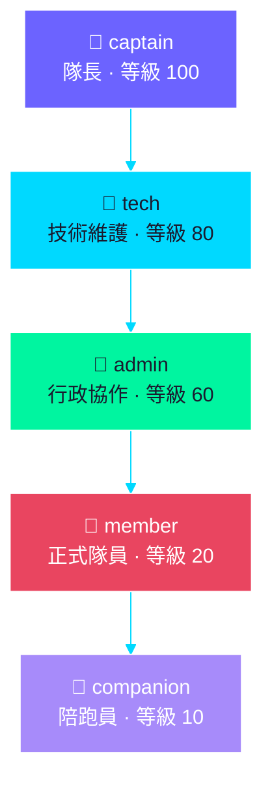
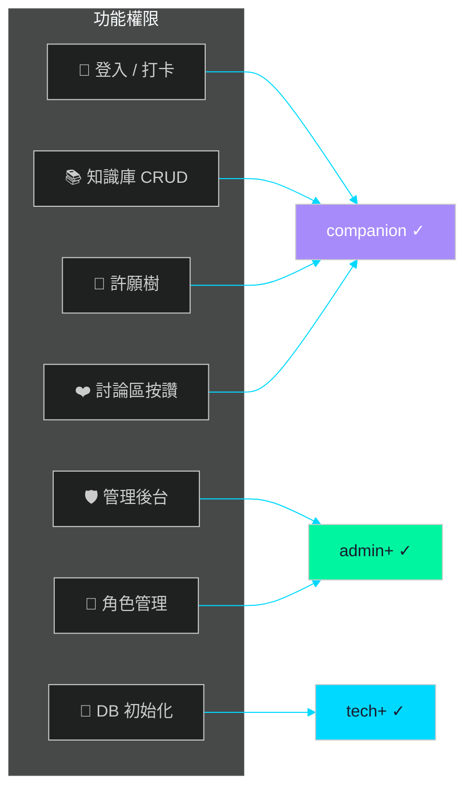
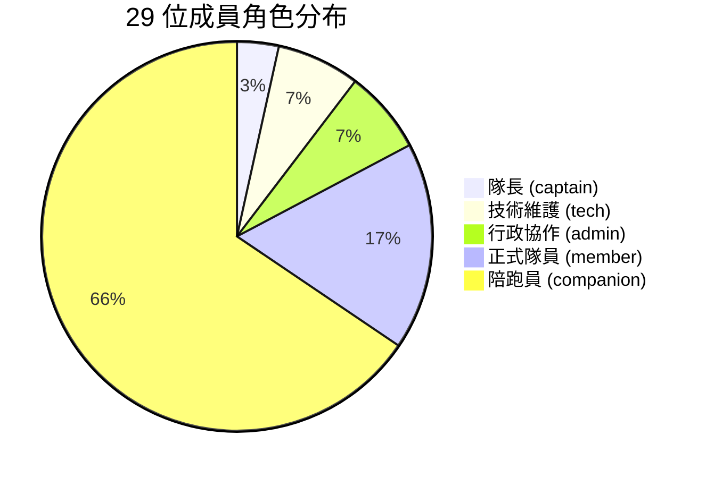
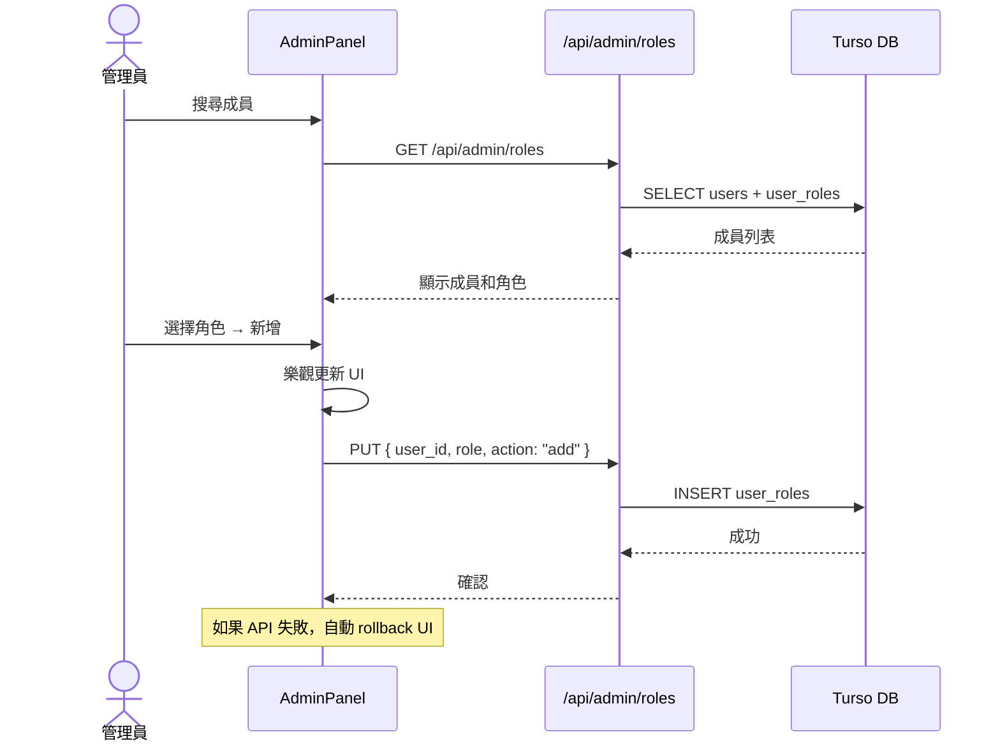

# 角色與權限

> Cyclone 使用 RBAC（角色型存取控制），共 5 個等級：captain > tech > admin > member > companion。高等級自動繼承低等級所有權限，例如 captain 可做任何事，陪跑員可打卡、知識庫 CRUD、許願樹、討論區按讚。

## RBAC 階級

**規則**：高等級自動擁有低等級的所有權限。

## 權限對照

| 功能 | companion | member | admin | tech | captain |
|------|:---------:|:------:|:-----:|:----:|:-------:|
| 登入 / 打卡 | ✓ | ✓ | ✓ | ✓ | ✓ |
| 知識庫 CRUD | ✓ | ✓ | ✓ | ✓ | ✓ |
| 許願樹 | ✓ | ✓ | ✓ | ✓ | ✓ |
| 討論區按讚 | ✓ | ✓ | ✓ | ✓ | ✓ |
| 管理後台 | ✗ | ✗ | ✓ | ✓ | ✓ |
| 角色管理 | ✗ | ✗ | ✓ | ✓ | ✓ |
| DB 初始化 | ✗ | ✗ | ✗ | ✓ | ✓ |

## 成員分布

## 實作

- 權限檢查：`src/lib/auth.ts` — `requireAuth()` + `requireRole()`
- 前端判斷：`src/components/auth/useAuth.ts` — `isRole()`
- 管理後台：`src/components/admin/AdminPanel.tsx`
- 角色管理 API：`functions/api/admin/roles.ts`（PUT）

## 角色管理流程

## 角色管理

透過管理後台 `/admin` 頁面操作：
1. 登入後，admin 以上角色可存取
2. 搜尋成員 → 下拉選擇角色 → 新增/移除
3. 不能移除自己的管理權限（防鎖定）
